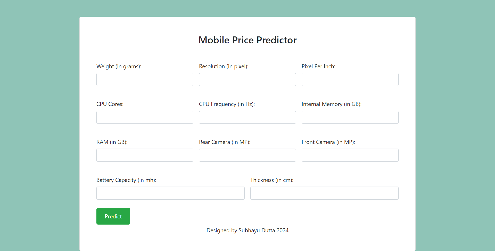

# ValueMyMobile App

ValueMyMobile is an application for predicting the price of mobile phones based on various features using machine learning models.

The main objective of this project is to develop a robust pipeline for mobile price detection that incorporates various MLOps practices such as version control, continuous integration/continuous deployment (CI/CD), and model deployment.

In this README, we will walk you through the folder structure, pipeline stages, the model used, how to run the code, CI/CD deployment using AWS EC2 and GitHub Actions, evaluation metrics, dependencies, conclusion, future work, and acknowledgements.

 

## Features

- Predict mobile phone prices based on features like weight, resolution, CPU cores, etc.
- User-friendly web interface for inputting mobile specifications.
- Provides predicted prices with detailed explanations.

## Folder Structure

- **src/reviewAnalysis**: This directory contains the main source code for the project.
  - **components**: This subdirectory holds reusable components used in the pipeline, such as data ingestion, validation, transformation, model trainer, and model evaluation.
  - **utils**: Here, utility functions and helpers are stored, facilitating various tasks throughout the project.
  - **logging**: Contains configurations and setup for logging functionalities.
  - **config**: Holds project configuration files, including the main configuration file `configuration.py`.
  - **pipeline**: This directory houses the pipeline definition and stages, including data ingestion, validation, transformation, model trainer, and model evaluation.
  - **entity**: Contains entity classes used in the project, such as `config_entity.py`.
  - **constants**: Holds constant values used across the project.

- **config**: This directory contains project-wide configuration files, including `config.yaml` for general configurations and `params.yaml` for parameter configurations.

- **app.py** and **main.py**: These files serve as entry points for running the application and executing the main functionality.

- **Dockerfile**: This file specifies the instructions to build a Docker image for the project, ensuring consistency and portability of the environment.

- **requirements.txt**: Lists all the Python dependencies required to run the project. Useful for setting up the environment.

- **setup.py**: This file defines metadata about the project and its dependencies. Useful for packaging and distribution.

- **research/trials.ipynb**: This directory contains Jupyter Notebook files used for research, experiments, and trials during the development phase.

## Pipeline Stages

### Data Ingestion
Data is acquired from Kaggle ([Link](https://www.kaggle.com/datasets/mohannapd/mobile-price-prediction)) and stored on Google Drive for easy access. To retrieve the data, we use the `gdown` library to download it from Google Drive and store it in the local environment. Subsequently, the downloaded data is saved in the artifacts folder within the data ingestion directory. We then use the `zipfile` module to unzip the downloaded file, ensuring that the data is readily available for further processing.

### Data Validation
In this stage, we perform thorough validation checks on the acquired data to ensure its integrity and quality. All necessary files are examined for completeness, consistency, and adherence to predefined standards. The validation process involves verifying file formats, data types, and structural integrity. The results of the validation checks are recorded in a `status.txt` file within the artifacts folder of the data validation directory. This allows for easy tracking and monitoring of the data validation process.

### Data Transformation

Data transformation is a crucial stage where raw text data undergoes preprocessing to make it suitable for model training.

### Model Trainer
The model trainer pipeline applies Elastic Net linear regression, balancing between Lasso and Ridge regularization to enhance predictive accuracy while mitigating multicollinearity, ensuring robust model performance across this dataset.

### Model Evaluation
Model evaluation is performed to assess the performance of the trained model on unseen data.

## How to Run the Code

To run the code, follow these steps:

### Clone the repository:
```bash
git clone https://github.com/subhayudutta/ValueMyMobile.git
```

### Setting up the Environment

Activate the Conda environment named `pricePred` using the following command:
   ```bash
   conda activate pricePred
   pip install -r requirements.txt
   ```

### Running the Pipeline
To execute all pipeline stages, you have two options:

1. Run main.py using Python:
    ```bash
    python main.py
    ```
This command will execute all pipeline stages sequentially.

### Running the Flask App
To run the Flask web application, execute the following command:
```bash
python app.py
```
This command will start the Flask server with the specified host (0.0.0.0) and port (8080). This allows the Flask app to be accessible from any network interface on the specified port.

### Predicting Price
Once the Flask app is running, you can access the following endpoints:
```
/predict: Use this endpoint to predict price for a given inputs. You can either use cURL commands or visit the endpoint through your web browser.
```

### Training the Model
To train the model, use the following endpoint:
```
/train: Use this endpoint to trigger model training. You can either use cURL commands or visit the endpoint through your web browser.
```
## CI/CD Deployment using AWS EC2 and GitHub Actions

To deploy your application using AWS EC2 and GitHub Actions, follow these steps:

### Setting up AWS

1. Log in to the AWS console.

2. Create an IAM user for deployment with specific access:
   - Grant EC2 access for launching virtual machines.
   - Grant access to ECR (Elastic Container Registry) to save your Docker images in AWS.

### Description of Deployment

1. Build the Docker image of your source code.

2. Push your Docker image to ECR.

3. Launch your EC2 instance.

4. Pull your Docker image from ECR into the EC2 instance.

5. Launch your Docker image in the EC2 instance.

### Required IAM Policies

Ensure the IAM user has the following policies attached:
   - AmazonEC2ContainerRegistryFullAccess
   - AmazonEC2FullAccess

### Setup Steps

1. Create an ECR repository to store/save the Docker image. 

2. Create an EC2 instance (Ubuntu).

3. Install Docker in the EC2 instance (optional):
   ```bash
   sudo apt-get update -y
   sudo apt-get upgrade
   curl -fsSL https://get.docker.com -o get-docker.sh
   sudo sh get-docker.sh
   sudo usermod -aG docker ubuntu
   newgrp docker
    ```

### Configuring EC2 as a Self-hosted Runner

1. Navigate to your GitHub repository.
2. Go to **Settings** > **Actions** > **Runners**.
3. Click on **New self-hosted runner**.
4. Choose the operating system for your EC2 instance.
5. Follow the instructions provided to download and configure the runner on your EC2 instance.

### Setting up GitHub Secrets

To securely store sensitive information required for deployment, such as AWS credentials and repository URIs, you can use GitHub Secrets. Follow these steps to set up the necessary secrets:

1. Navigate to your GitHub repository.
2. Go to **Settings** > **Secrets** > **Actions**.
3. Click on **New repository secret**.
4. Add the following secrets:
   - `AWS_ACCESS_KEY_ID`: Your AWS access key ID.
   - `AWS_SECRET_ACCESS_KEY`: Your AWS secret access key.
   - `AWS_REGION`: The AWS region where your resources are located (e.g., `ap-south-1`).
   - `AWS_ECR_LOGIN_URI`: The URI for logging into your ECR (e.g., `11111.dkr.ecr.ap-south-1.amazonaws.com`).
   - `ECR_REPOSITORY_NAME`: The name of your ECR repository (e.g., `review-analysis`).

These steps enable automated deployment of your application to AWS EC2 using GitHub Actions.

## License and Acknowledgements

This project is licensed under the [GNU License](LICENSE.md). Feel free to use, modify, and distribute the code for your own purposes.

I would like to acknowledge the contributions of the open-source community, without which this project would not have been possible. Special thanks to the creators and maintainers of libraries, frameworks, and tools that have been instrumental in the development and deployment of this project.

## Contact Me

For any inquiries, feedback, or collaboration opportunities, please feel free to reach out to me via email at duttasuvo90@gmail.com.

